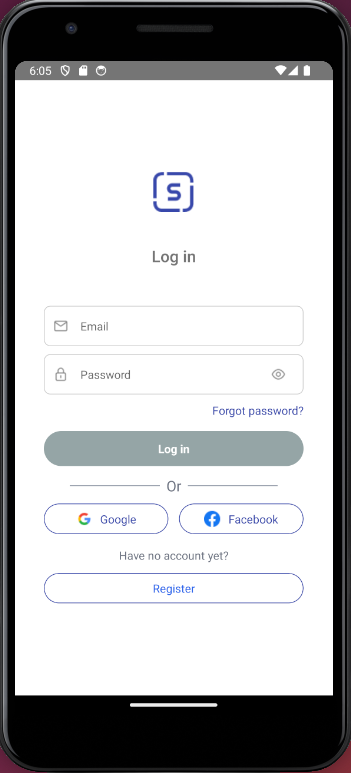
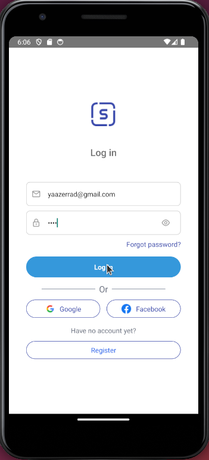
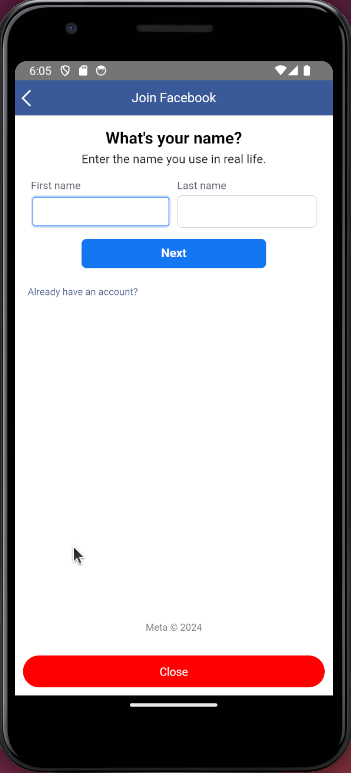
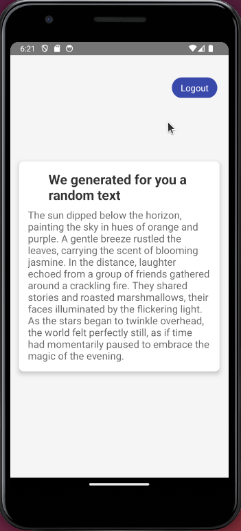
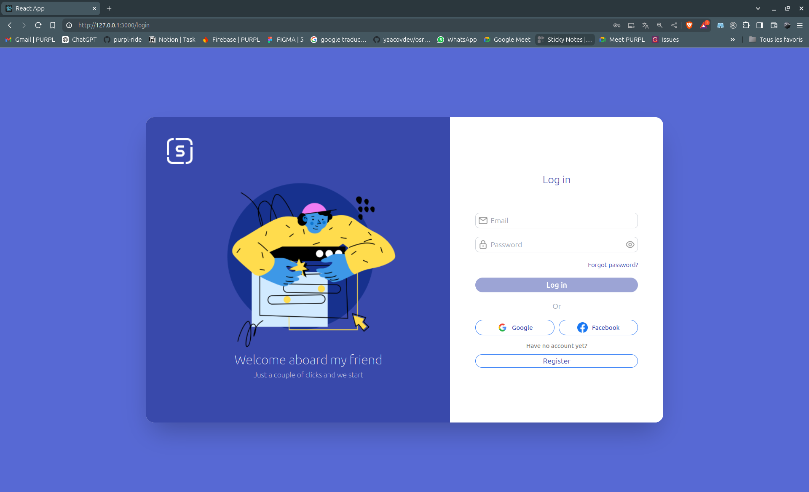
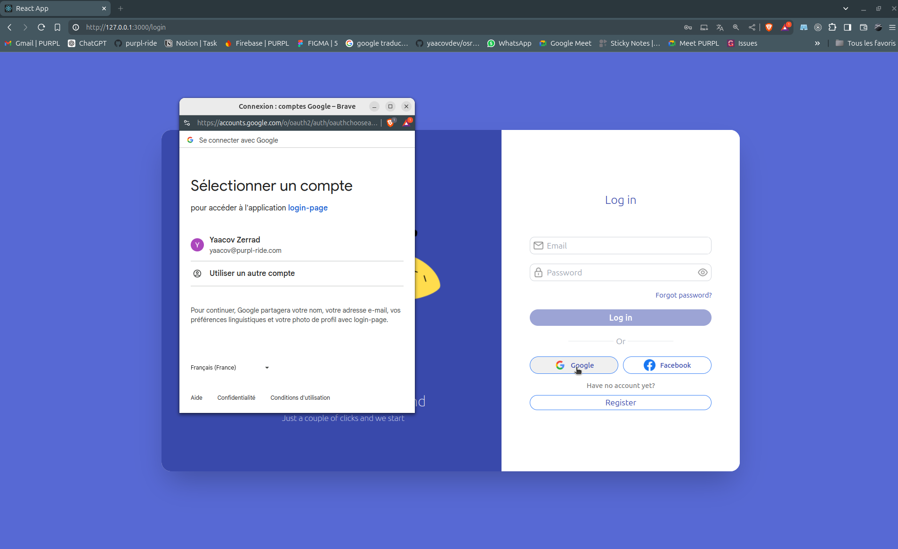
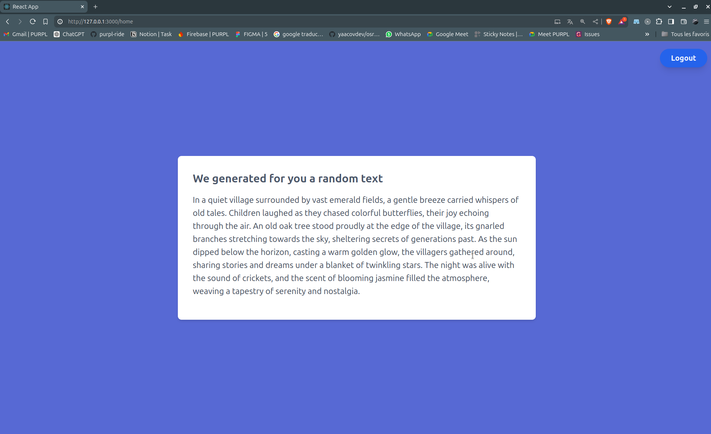

# Login Page Project

This project is designed to demonstrate a full-stack registration interface using 
- React Native for mobile,
- React JS for the web,
- Python for the server-login. 
- NodeJs for OpenIA integration.

The application is Dockerized and includes MongoDB for database management. Additional functionality includes sending Toast messages with random text obtained from an OpenAI GPT API.


## Project Structure

```plaintext
login-page
├── sceenshots
├── backend
│   ├── login_server
│   │   ├── app
│   │   ├── Dockerfile
│   │   ├── requirements.txt
│   │   ├── run.py
│   │   └── ...
│   └── openia_api
│       ├── Dockerfile
│       ├── package.json
│       ├── package-lock.json
│       ├── src
│       └── ...
├── docker-compose.yml
├── frontend
│   ├── MobileRegistration
│   │   ├── App.tsx
│   │   ├── assets
│   │   ├── index.js
│   │   ├── package.json
│   │   ├── README.md
│   │   ├── src
│   │   ├── tailwind.config.js
│   │   └── ...
│   └── web-registration
│       ├── Dockerfile
│       ├── package.json
│       ├── public
│       ├── README.md
│       ├── src
│       └── ...
├── Makefile
├── README.md
└── docker-compose.yml
```

## Requirements
- React Native for the mobile registration interface
- React JS for the web registration interface
- Python for the server-login
- MongoDB for database management
- NodeJS for the OpenAI GPT API server

## Setup Instructions
1. Initialize the Database
```
make init_db
```
2. Initialize the Server
```sh
make init_server
```
3. Start MongoDB
```sh
make start_db
```
4. Start the Server
```sh
make start_server
```
5. Start the OpenAI API

```sh
make start_openia
```
6. Start the Web Interface
```sh
make start_web
```
7. Start the Mobile App
```sh
make start_mobile
```

## Docker Compose
You can also use Docker Compose to build and start all services (without Mobile):
```sh
docker-compose up --build
```
This will build the necessary images and start all containers defined in `docker-compose.yml`.

## Additional Information
After registration, a Simple Text will be sent to the user.
The Toast message content is retrieved from an OpenAI GPT API server running on a second server written in NodeJS.

## Reporting Progress
Please report your progress and upload your code to the shared GitHub repository.


## Screenshots


### Mobile Registration Interface










### Web Registration Interface




